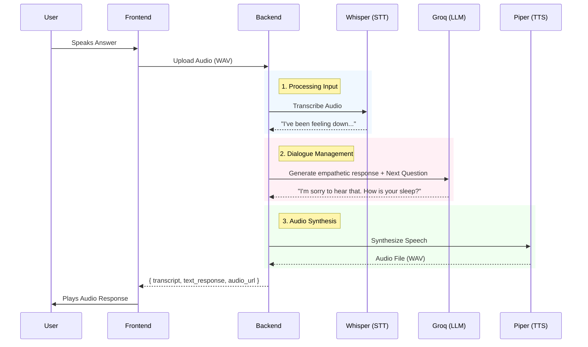

# Conversational Health Analytics

This project is an AI-powered platform designed to screen for depression through natural conversation. It conducts structured clinical interviews (PHQ-8) using both voice and text, analyzing user responses with multi-modal AI to provide clinical insights.

## Project Overview

The system combines state-of-the-art speech and language models to create an empathetic, privacy-focused conversational agent. It moves beyond simple questionnaires by engaging users in dynamic dialogue, paraphrasing questions based on context, and analyzing acoustic biomarkers.

### Key Features
- **Multi-modal Interface**: Engage via text chat or real-time voice conversation.
- **Empathetic AI**: Uses **Groq (Llama 3)** to generate context-aware, comforting responses.
- **Clinical Validity**: Strictly adheres to the PHQ-8 depression screening protocol.
- **Real-time Speech Processing**: Local **Whisper** (STT) and **Piper** (TTS) integration.
- **Predictive Analytics**: Fine-tuned **RoBERTa** model predicts depression severity scores.
- **Secure Data**: Session data stored in **Firebase Firestore**.

## Tech Stack

### Frontend
- **React (Vite)**: Fast, responsive UI.
- **TypeScript**: Type-safe development.
- **Tailwind CSS**: Modern styling.
- **Audio Recorder**: Browser-based media capture.

### Backend
- **FastAPI**: High-performance Python API.
- **PyTorch & Transformers**: Deep learning inference.
- **Firebase Admin SDK**: Server-side data management.
- **Docker**: Containerized deployment.

## Technical Architecture

The system built on a microservices-inspired architecture, separating the frontend user interface from the heavy-lifting AI backend.

### System Overview

```mermaid
graph TD
    Client[Frontend (React)] <-->|REST API / Audio Stream| API[FastAPI Backend]
    
    subgraph "AI Pipeline"
        API --> STT[Whisper STT]
        API --> LLM[Groq Llama 3]
        API --> TTS[Piper TTS]
        API --> Model[RoBERTa Depression Model]
    end
    
    subgraph "Data Persistence"
        API --> DB[(Firebase Firestore)]
    end

    STT -->|Transcript| LLM
    LLM -->|Response Text| TTS
    STT -->|Conversation History| Model
    Model -->|Depression Score| DB
```

### Audio Conversation Flow

When a user speaks, the audio data traverses a complex pipeline to generate a natural, empathetic response while simultaneously analyzing for clinical biomarkers.



### AI Models & Logic

1.  **Speech-to-Text (Whisper)**: Validates and transcribes user audio input into text. We use the `tiny` model for low-latency local inference.
2.  **Dialogue Manager (Groq Llama 3)**: Serves as the compassionate "clinician." It paraphrases PHQ-8 questions based on user context to maintain a natural conversation flow.
3.  **Text-to-Speech (Piper)**: Converts the LLM's text response into a calm, soothing voice for audio playback.
4.  **Depression Prediction (RoBERTa)**: 
    -   Once the interview concludes, the entire conversation transcript is vectorized.
    -   A fine-tuned **RoBERTa** model analyzes the semantic patterns.
    -   The model outputs a **PHQ-8 score (0-24)**, quantifying depression severity.

## Quick Start

### Prerequisites
- Node.js 18+
- Python 3.10+
- Docker (optional, for containerized run)
- Groq API Key & Firebase Credentials

### 1. Backend Setup

```bash
cd backend
python3 -m venv venv
source venv/bin/activate
pip install -r requirements.txt

# Configure environment
cp .env.example .env
# Edit .env with your API keys
```

Start the backend server:

```bash
uvicorn main:app --reload
```

### 2. Frontend Setup

```bash
cd frontend
npm install
npm run dev
```

Open your browser at `http://localhost:5173`.

## Documentation

- **[Backend README](backend/README.md)**: Detailed backend setup and architecture.
- **[API Documentation](backend/API_DOCUMENTATION.md)**: Full API reference.
- **[Deployment Guide](backend/EC2_DEPLOYMENT.md)**: Instructions for deploying to AWS EC2.

## License

MIT License. See [LICENSE](LICENSE) for details.