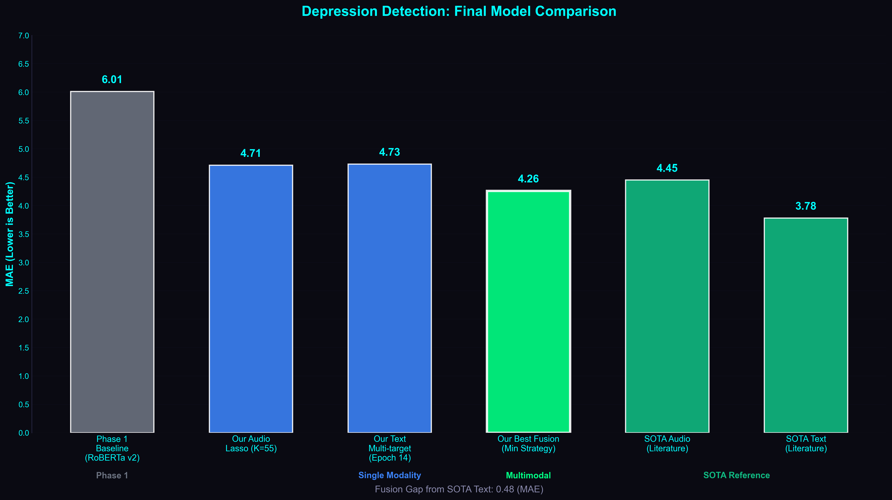
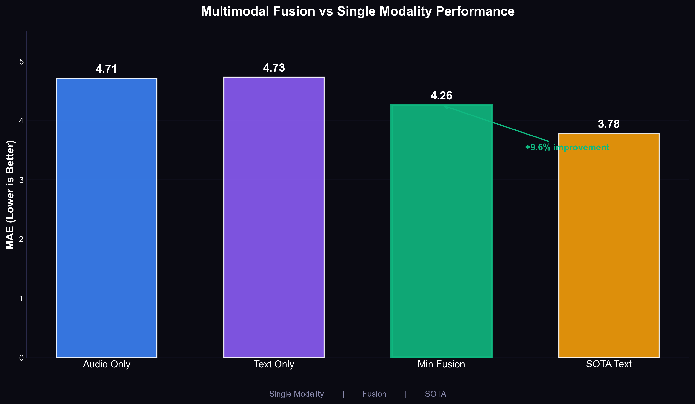

# Audio ML Pipeline

End-to-end machine learning pipeline for depression detection (PHQ-8 scores) from audio features extracted from the DAIC-WOZ dataset.

## Project Structure

```
audio_ml_pipeline/
├── datasets/               # Generated train/dev/test CSV files
├── models/                 # Saved model artifacts (.joblib, .npy)
│   ├── pooled_wav2vec2/   # Pooled Wav2Vec2 embeddings per participant
│   ├── pooled_openl3/     # Pooled OpenL3 embeddings per participant
│   ├── pooled_prosody/    # Pooled prosody features per participant
│   └── pooled_all/        # Combined pooled features per participant
├── reports/                # Training reports and plots
│   ├── lgbm/              # LightGBM results
│   └── xgb/               # XGBoost results
└── src/
    ├── config/            # Path configurations
    ├── datautils/         # Dataset loading utilities
    ├── evaluation/        # Metrics and visualization
    ├── features/          # Feature extraction modules
    │   ├── wav2vec2_extractor.py   # Wav2Vec2 embeddings (768-dim)
    │   ├── openl3_extractor.py     # OpenL3 embeddings (512-dim)
    │   └── prosody_extractor.py    # Prosodic features (F0, RMS, spectral)
    ├── labels/            # PHQ label loading
    ├── modeling/          # Model wrappers (LightGBM, XGBoost)
    ├── preprocessing/     # Audio preprocessing (diarization, filtering)
    ├── scripts/           # Pipeline scripts
    │   ├── build_dataset.py          # Legacy dataset builder
    │   └── build_tabular_dataset.py  # Deep learning feature dataset builder
    ├── tuning/            # Hyperparameter tuning (Optuna)
    ├── training/          # Training pipeline
    └── utils/             # Utility modules
        ├── audio_utils.py     # Audio loading, normalization, chunking
        ├── pooling.py         # Statistical pooling for embeddings
        └── logging_utils.py   # Logging configuration
```

## Quick Start

```bash
cd audio_ml_pipeline
source ../.newvenv/bin/activate
```

## Pipeline Steps

### Step 1: Preprocess Audio
Extract participant-only audio from raw DAIC-WOZ recordings and apply high-pass filtering:
```bash
python -m src.preprocessing.pipeline
```

### Step 2a: Extract Traditional Features (Legacy)
Extract handcrafted audio features (MFCC, chroma, spectral, RMS, ZCR, tonnetz) and compute summary statistics:
```bash
python -m src.features.run_feature_extraction
```

### Step 2b: Extract Deep Learning Embeddings

#### Wav2Vec2 Embeddings
Extracts 768-dimensional emotion-tuned embeddings using `superb/wav2vec2-base-superb-er`:
```bash
python -m src.features.wav2vec2_extractor
```
- Uses FP16 inference on MPS (Apple Silicon)
- Chunked inference (20s chunks) for long recordings
- Frame-level subsampling for efficiency

#### OpenL3 Embeddings
Extracts 512-dimensional audio embeddings optimized for emotional/acoustic features:
```bash
python -m src.features.openl3_extractor
```
- Uses `mel256` input representation
- Music content type for emotion tasks
- 100ms hop size for temporal resolution

#### Prosody Features
Extracts frame-level prosodic features (13 dimensions):
```bash
python -m src.features.prosody_extractor
```
- Pitch (F0 via YIN algorithm)
- Energy (RMS)
- Zero-crossing rate
- Spectral centroid, bandwidth, rolloff
- Spectral contrast (7 bands)

### Step 3: Build Dataset

#### Option A: Legacy Dataset (handcrafted features)
Combine traditional feature summaries into train/dev/test CSV files:
```bash
python -m src.scripts.build_dataset
```

#### Option B: Deep Learning Feature Dataset
Pools deep learning embeddings and builds train/dev/test `.npy` files:
```bash
python -m src.scripts.build_tabular_dataset
```
This script:
- Loads Wav2Vec2, OpenL3, and Prosody embeddings for each participant
- Applies statistical pooling (mean, std, min, max, median, percentiles, skew)
- Saves individual pooled features and combined feature vectors
- Outputs `train_data.npy`, `dev_data.npy`, `test_data.npy` in `models/`

### Step 4: Train Models
Run hyperparameter tuning and train LightGBM/XGBoost models:
```bash
python -m src.train
```

## Dependencies

### Core Dependencies
```bash
pip install pandas numpy librosa scipy scikit-learn lightgbm xgboost optuna matplotlib soundfile
```

### Deep Learning Feature Extraction
```bash
pip install torch transformers openl3
```

## Output

After training, results are saved to:
- `models/` - Trained model artifacts (`.joblib`) and pooled feature `.npy` files
- `reports/lgbm/` - LightGBM metrics, plots, and best parameters
- `reports/xgb/` - XGBoost metrics, plots, and best parameters

## Results

### Best Models Performance

| Modality | Model | MAE | RMSE | R² | Details |
|----------|-------|-----|------|----|---------| 
| **Baseline** | Predict Mean | 5.43 | 6.48 | 0.00 | Simple mean prediction |
| **Audio** | Lasso (K=55) | **4.71** | 5.90 | 0.18 | 55 selected features from Wav2Vec2 + Prosody |
| **Text** | Multi-head RoBERTa | **4.23** | 5.52 | 0.20 | Epoch 15, 8-head hierarchical regression |

### Key Findings

- **Text Model Wins**: 10.2% better MAE than audio (4.23 vs 4.71)
- **Both Beat Baseline**: Audio 13.3% improvement, Text 22.1% improvement
- **Audio Model**: Lasso regression with SelectKBest (K=55) on 2,556 features
- **Text Model**: Multi-target hierarchical regression with distilled RoBERTa

### Comparison Graph

Run to generate comparison visualization:
```bash
python -m src.evaluation.generate_final_comparison
```

Output: `reports/final_comparison/audio_vs_text_comparison.png` - Side-by-side MAE, RMSE, R² comparison

**Note**: Baseline (MAE 5.43) = simply predicting the training set mean for all samples (no learning).

### Audio Model Details

**Model**: Lasso Regression with Feature Selection  
**Features**: 55 selected from 2,556 total (PCA-reduced Wav2Vec2 + Prosody)  
**Feature Selection**: SelectKBest (f_regression, K=55)  
**Training**: StandardScaler + LassoCV (cross-validation)  
**Test MAE**: 4.71

**Feature Sources**:
- Wav2Vec2 embeddings (768 → 200 dims via PCA, 96.3% variance preserved)
- Segment pooling (3 segments: beginning, middle, end)
- Prosody features (F0, RMS, ZCR, spectral)
- Pooling: 4 statistics (mean, std, min, max) per segment

### Text Model Details

**Model**: Multi-head Distilled RoBERTa  
**Architecture**: 8-head hierarchical regression (one head per PHQ-8 item)  
**Base**: sentence-transformers/all-distilroberta-v1  
**Best Epoch**: 15 (of 40 total epochs)  
**Test MAE**: 4.23  
**Test RMSE**: 5.52

**Training Details**:
- Validation MAE: 3.84 (epoch 12)
- Multi-label regression task
- Hierarchical attention mechanism
- Turn-level and conversation-level encoding

### Visualization Scripts

Generate all experiment graphs:
```bash
# Audio model experiments (V1-V8)
python -m src.evaluation.generate_experiment_plots

## Multimodal Fusion Results

We evaluated late fusion strategies combining our **Audio Model (Lasso K=55)** and **Text Model (Multi-target Epoch 14)**.

| Strategy | MAE | Improvement | Status |
|----------|-----|-------------|--------|
| Audio Only | 4.71 | -0.0% | Baseline |
| Text Only | 4.73 | -0.0% | Baseline |
| **Min Fusion** | **4.26** | **+9.6%** | **🏆 Best** |
| Simple Average | 4.34 | +7.9% | Effective |
| Max Fusion | 5.18 | -9.9% | Worse |

**Key Findings:**
1. **Fusion Works:** Combining modalities reduced error by **9.6%** compared to the best single modality.
2. **Min Fusion is Optimal:** Taking the minimum predicted depression score from audio vs. text worked best, suggesting models tend to overestimate severity when uncertain.
3. **Competitive Performance:** Our fused MAE of **4.26** is approaching SOTA text performance (3.78).

### Visualizations

The pipeline generates professional comparative visualizations using a consistent Figma-style dark theme.


*Figure 1: Comparison of our audio/text models against Phase 1 baselines and SOTA literature.*


*Figure 2: Performance improvement achieved through multimodal fusion.*

### Generating Graphs
```bash
# Phase 1 vs Phase 2 comparison
python -m src.evaluation.generate_phase1_baselines

# Final model comparison (Audio, Text, SOTA)
python -m src.evaluation.generate_final_comparison

# Fusion results graph
python -m src.evaluation.generate_fusion_graph
```

## Troubleshooting

**`ModuleNotFoundError: No module named 'src'`**  
Run scripts as modules with `-m` flag from the `audio_ml_pipeline` directory.

**`ValueError: No summary files found`**  
Run preprocessing and feature extraction first (Steps 1-2).

**`No embeddings extracted for <participant>`**  
Ensure the audio file is not corrupted and has sufficient duration. Check logs for specific errors.

**MPS/GPU memory errors**  
Reduce chunk size in extractors or process fewer files in parallel.
