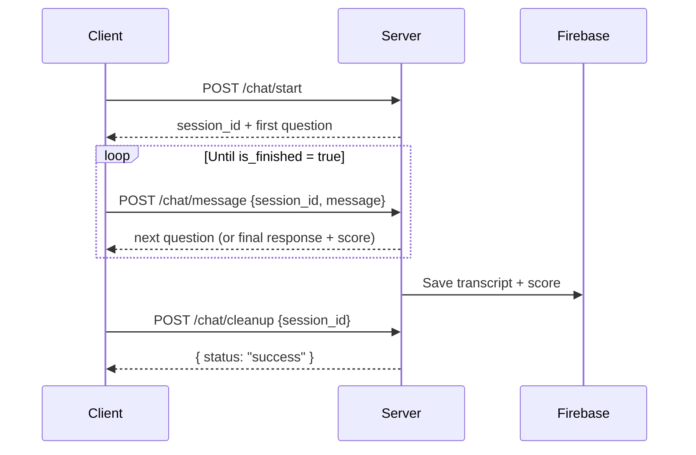
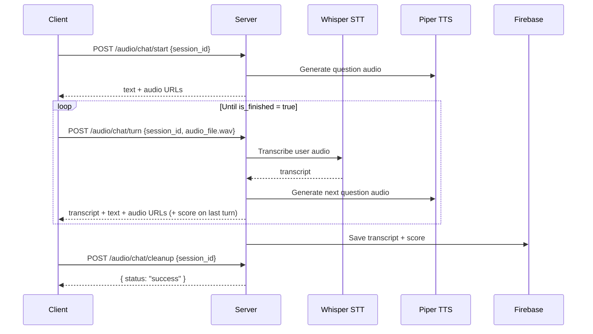

# Conversational Health Analytics — API Reference

> **Base URL:** `http://localhost:8000`
> **Version:** 1.0 &nbsp;|&nbsp; **Protocol:** REST over HTTP &nbsp;|&nbsp; **Format:** JSON

---

## Overview

This API powers a conversational depression screening tool. It conducts a structured clinical interview (based on the PHQ-8 questionnaire) through either **text** or **audio**, then generates a depression severity score using a fine-tuned RoBERTa model.

### How it works

```
┌─────────┐     POST /start     ┌─────────┐
│  Client  │ ──────────────────► │  Server  │  ← Creates session, returns first question
└─────────┘                     └─────────┘

┌─────────┐   POST /message     ┌─────────┐
│  Client  │ ──────────────────► │  Server  │  ← Processes answer, returns next question
└─────────┘   (repeat 8-12x)    └─────────┘

┌─────────┐   POST /cleanup     ┌─────────┐
│  Client  │ ──────────────────► │  Server  │  ← Tears down session
└─────────┘                     └─────────┘
```

### Key concepts

| Concept | Description |
|---------|-------------|
| **Session** | A single conversation identified by a `session_id`. Created at `/start`, destroyed at `/cleanup`. |
| **Turn** | One exchange: user sends a message (or audio), bot responds with the next question. |
| **Finished** | When `is_finished: true`, the conversation is complete and `depression_score` is populated. |
| **Depression Score** | A float value (0–24 scale, based on PHQ-8) indicating depression severity. |

---

## Text Chat API

All text endpoints are prefixed with `/api/v1/chat`.

---

### `POST /api/v1/chat/start`

Start a new text conversation session.

**Request**

No body required. Send an empty POST request.

```bash
curl -X POST http://localhost:8000/api/v1/chat/start
```

**Response** — `200 OK`

```json
{
  "response": [
    "Hello! I'm here to have a conversation with you about how you've been feeling lately.",
    "Over the last two weeks, how often have you been bothered by having little interest or pleasure in doing things?"
  ],
  "is_finished": false,
  "depression_score": null,
  "session_id": "a1b2c3d4-e5f6-7890-abcd-ef1234567890"
}
```

| Field | Type | Description |
|-------|------|-------------|
| `response` | `string[]` | Bot's message(s). May be a single greeting or multiple parts. |
| `is_finished` | `boolean` | Always `false` on start. |
| `depression_score` | `float \| null` | Always `null` on start. |
| `session_id` | `string` | UUID to use in all subsequent requests for this conversation. |

---

### `POST /api/v1/chat/message`

Send a user message and receive the next bot response.

**Request** — `application/json`

```json
{
  "message": "I've been feeling that way nearly every day.",
  "session_id": "a1b2c3d4-e5f6-7890-abcd-ef1234567890"
}
```

| Field | Type | Required | Description |
|-------|------|----------|-------------|
| `message` | `string` | yes | The user's text response to the current question. |
| `session_id` | `string` | yes | Session ID from `/start`. |

```bash
curl -X POST http://localhost:8000/api/v1/chat/message \
  -H "Content-Type: application/json" \
  -d '{"message": "Nearly every day", "session_id": "a1b2c3d4-..."}'
```

**Response** — `200 OK`

```json
{
  "response": ["How often have you felt down, depressed, or hopeless?"],
  "is_finished": false,
  "depression_score": null,
  "session_id": "a1b2c3d4-e5f6-7890-abcd-ef1234567890"
}
```

**Final turn response** (when conversation completes):

```json
{
  "response": ["Thank you for sharing. Take care of yourself."],
  "is_finished": true,
  "depression_score": 12.4532,
  "session_id": "a1b2c3d4-e5f6-7890-abcd-ef1234567890"
}
```

> [!NOTE]
> When `is_finished` is `true`, the conversation is complete. The `depression_score` contains the model's prediction. No further messages should be sent for this session.

---

### `POST /api/v1/chat/cleanup`

Clean up a text conversation session. Called when the user navigates away or closes the browser.

**Request** — `application/json` or `text/plain`

```json
{
  "session_id": "a1b2c3d4-e5f6-7890-abcd-ef1234567890"
}
```

> [!TIP]
> This endpoint accepts `text/plain` content type to support `navigator.sendBeacon()` from the browser.

```bash
curl -X POST http://localhost:8000/api/v1/chat/cleanup \
  -H "Content-Type: application/json" \
  -d '{"session_id": "a1b2c3d4-..."}'
```

**Response** — `200 OK`

```json
{ "status": "success" }
```

If the session doesn't exist:

```json
{ "status": "skipped", "reason": "No session_id provided or session not found" }
```

---

## Audio Chat API

All audio endpoints are prefixed with `/api/v1/audio/chat`. Audio requests use **`multipart/form-data`** instead of JSON.

---

### `POST /api/v1/audio/chat/start`

Start a new audio conversation session.

**Request** — `multipart/form-data`

| Field | Type | Required | Description |
|-------|------|----------|-------------|
| `session_id` | `string` | yes | Client-generated unique ID for this session. |

```bash
curl -X POST http://localhost:8000/api/v1/audio/chat/start \
  -F "session_id=my-session-123"
```

**Response** — `200 OK`

```json
{
  "response_text": [
    "Hello! I'm here to have a conversation with you.",
    "Over the last two weeks, how often have you been bothered by having little interest or pleasure in doing things?"
  ],
  "response_audio_paths": [
    "/audio/questions/abc123.wav",
    "/audio/questions/def456.wav"
  ],
  "is_finished": false
}
```

| Field | Type | Description |
|-------|------|-------------|
| `response_text` | `string[]` | Text of the bot's spoken response, split by message part. |
| `response_audio_paths` | `string[]` | URLs to WAV audio files for each text part. Serve via `GET`. |
| `is_finished` | `boolean` | Always `false` on start. |

> [!IMPORTANT]
> Audio files are accessible as static files at the given paths (e.g., `GET http://localhost:8000/audio/questions/abc123.wav`).

---

### `POST /api/v1/audio/chat/turn`

Send user audio and receive the bot's next question as text + audio.

**Request** — `multipart/form-data`

| Field | Type | Required | Description |
|-------|------|----------|-------------|
| `session_id` | `string` | yes | Session ID used in `/start`. |
| `audio_file` | `file` (WAV) | yes | User's spoken response as a WAV audio file. |

```bash
curl -X POST http://localhost:8000/api/v1/audio/chat/turn \
  -F "session_id=my-session-123" \
  -F "audio_file=@recording.wav"
```

**Response** — `200 OK`

```json
{
  "transcript": "I've been feeling that way nearly every day",
  "response_text": ["How often have you felt down, depressed, or hopeless?"],
  "response_audio_paths": ["/audio/questions/ghi789.wav"],
  "is_finished": false
}
```

**Final turn response** (when conversation completes):

```json
{
  "transcript": "Not at all, I've been sleeping fine",
  "response_text": ["Thank you for sharing. Take care of yourself."],
  "response_audio_paths": ["/audio/questions/xyz999.wav"],
  "is_finished": true,
  "depression_score": 8.2103,
  "score_source": "text"
}
```

| Field | Type | Description |
|-------|------|-------------|
| `transcript` | `string` | Whisper STT transcription of the user's audio. |
| `response_text` | `string[]` | Bot's next question(s) as text. |
| `response_audio_paths` | `string[]` | WAV audio URLs for the bot's response. |
| `is_finished` | `boolean` | `true` when the conversation is complete. |
| `depression_score` | `float \| null` | Only present when `is_finished: true`. |
| `score_source` | `string \| null` | `"text"`, `"audio"`, or `"fusion"`. Indicates which model produced the score. |

---

### `POST /api/v1/audio/chat/cleanup`

Clean up session audio files and release resources.

**Request** — `multipart/form-data`

| Field | Type | Required | Description |
|-------|------|----------|-------------|
| `session_id` | `string` | yes | Session ID to clean up. |

```bash
curl -X POST http://localhost:8000/api/v1/audio/chat/cleanup \
  -F "session_id=my-session-123"
```

**Response** — `200 OK`

```json
{ "status": "success" }
```

If the session doesn't exist:

```json
{ "status": "skipped", "reason": "Session not found" }
```

---

## Error Handling

All errors follow a consistent format:

```json
{
  "detail": "Human-readable error message"
}
```

### HTTP Status Codes

| Code | Meaning | When |
|------|---------|------|
| `200` | Success | Request processed successfully. |
| `400` | Bad Request | Missing `session_id`, missing audio file, or session not found. |
| `500` | Internal Server Error | Model inference failed, TTS/STT error, or unexpected exception. |
| `503` | Service Unavailable | Server is still loading models (templates not initialized). |

### Common errors

**Session not found**
```json
// 400
{ "detail": "No active conversation for session abc123. Call /start first." }
```

**Server still loading**
```json
// 503
{ "detail": "Templates not initialized" }
```

---

## Conversation Lifecycle

### Text mode



### Audio mode



---

## Environment Variables

These variables configure the backend. Set them in a `.env` file in the `backend/` directory.

| Variable | Required | Default | Description |
|----------|----------|---------|-------------|
| `GROQ_API_KEY` | yes | — | API key for Groq LLM (paraphrasing). |
| `FIREBASE_CREDENTIALS_PATH` | yes | — | Path to Firebase service account JSON. |
| `ROBERTA_MODEL_PATH` | no | `models/roberta/model_2_13.pt` | Path to the depression scoring model. |
| `PIPER_EXECUTABLE_PATH` | no | `piper` | Path to Piper TTS binary. |
| `PIPER_MODEL_PATH` | no | `models/piper/en_US-lessac-medium.onnx` | Path to the Piper voice model. |
| `WHISPER_MODEL_SIZE` | no | `small` | Whisper model size (`tiny`, `base`, `small`, `medium`, `large`). |
| `TOKENIZER_NAME` | no | `sentence-transformers/all-distilroberta-v1` | HuggingFace tokenizer name. |

---

## Running the Server

```bash
# Development (with auto-reload)
cd backend
uvicorn main:app --reload

# Production
uvicorn main:app --host 0.0.0.0 --port 8000
```

The server will print a startup status table showing which components loaded successfully:

```
╔══════════════════════════════════════════════╗
║     Conversational Health Analytics          ║
╠══════════════════════════════════════════════╣
  Templates      OK     app/conversation/data
  Firebase       OK     Firestore connected
  Text Model     OK     MPS (Apple Silicon)
  Audio Model    SKIP   Models not found
╚══════════════════════════════════════════════╝
```

### Interactive docs

FastAPI auto-generates interactive API docs:

- **Swagger UI:** [http://localhost:8000/docs](http://localhost:8000/docs)
- **ReDoc:** [http://localhost:8000/redoc](http://localhost:8000/redoc)
